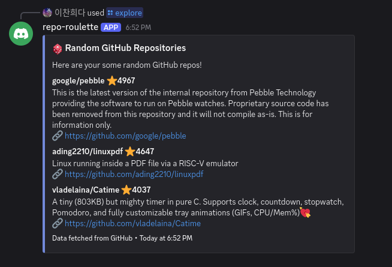

# Repository Explorer

> Discover random GitHub repositories you never knew existed 🎲

## Features

- 🎲 Randomly explores GitHub repositories
- 🔍 Filter by language, topic, stars, and year
- 🤖 Discord bot integration

## Commands

| Command | Description |
|---|---|
| `/explore` | Get 3 random repos |
| `/explore language:rust` | Filter by language |
| `/explore topic:cli` | Filter by topic |
| `/explore stars_min:100 stars_max:5000` | Filter by star range |
| `/explore year:2021` | Filter by created year |
